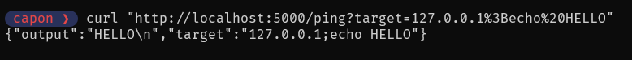
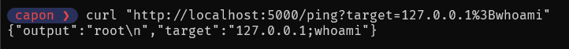
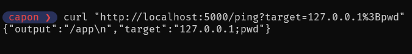
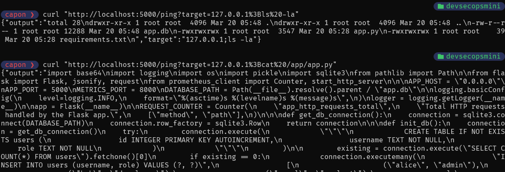
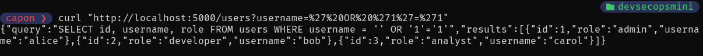
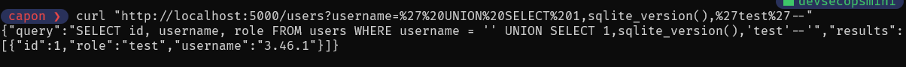
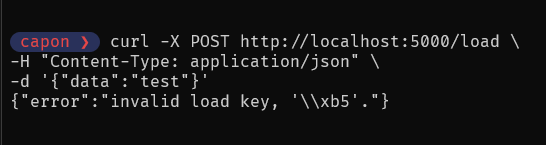
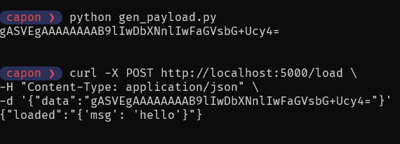
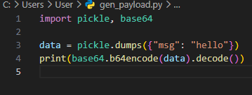

# 1. Command Injection

## Description

The `/ping` endpoint passes user-controlled input directly into a system command and executes it with `os.popen(...)`. Because the input is not sanitized or constrained before execution, shell input is treated as executable command content instead of untrusted data.

## Exploitation

Testing confirmed that attacker-supplied input can influence command execution. The following representative commands were successfully demonstrated through the vulnerable request flow:

- `echo HELLO`
- `whoami`
- `pwd`
- `ls -la`
- reading an application file from disk

## Evidence

### Echo

A basic echo command confirms that user input is executed by the underlying shell rather than handled as a safe parameter.

### Whoami

Execution of `whoami` shows that the application can be used to disclose the runtime user context of the container or host process.

### PWD

Execution of `pwd` demonstrates visibility into the server-side working directory and supports environment mapping during follow-on testing.

### LS + Read App

Directory listing and application file access demonstrate that the issue extends beyond command execution into direct file system exposure.

## Impact

- Remote command execution
- File system access
- Environment exposure

# 2. SQL Injection

## Description

The `/users` endpoint builds a SQL statement by concatenating user input directly into the query string. Because the query is not parameterized, attacker-controlled input can modify the intended logic and change the result set returned by SQLite.

## Exploitation

Testing demonstrated two common forms of SQL injection against the vulnerable query path:

- Authentication-bypass style predicate manipulation using `' OR '1'='1`
- UNION-based injection to append attacker-controlled query output

## Evidence

### Dump Users

The first test shows that injected input can alter the original filter logic and return data that should not be exposed through a normal request.

### Union Injection

The second test demonstrates UNION-based query manipulation, confirming that attacker-controlled SQL can extend the original result set.

## Impact

- Data extraction
- Database enumeration
- Unauthorized access

# 3. Insecure Deserialization

## Description

The `/load` endpoint accepts Base64-encoded input, decodes it, and passes the resulting bytes into `pickle.loads(...)`. This creates an unsafe deserialization path in which user-supplied serialized data is processed without validation or a safe object format.

## Exploitation

Testing covered both invalid and valid serialized input handling:

- Sending an invalid payload to observe application error behavior
- Sending a valid serialized object to confirm unsafe object reconstruction

## Evidence

### Error Handling

An invalid serialized input triggers an application error response, confirming that untrusted user input is reaching the deserialization routine.

### Valid Payload

A valid serialized object is accepted and reconstructed by the application, confirming unsafe deserialization of user-controlled content.

### Payload Generation

The following screenshot shows the preparation of the serialized input used during testing and supports the validity of the observed application behavior.

## Impact

- Arbitrary object injection
- Potential remote code execution
- Application compromise
